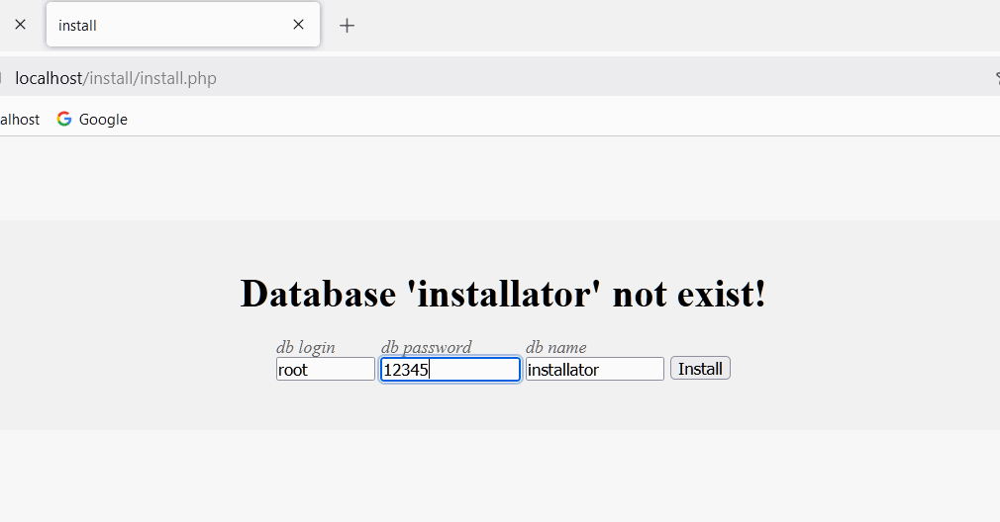
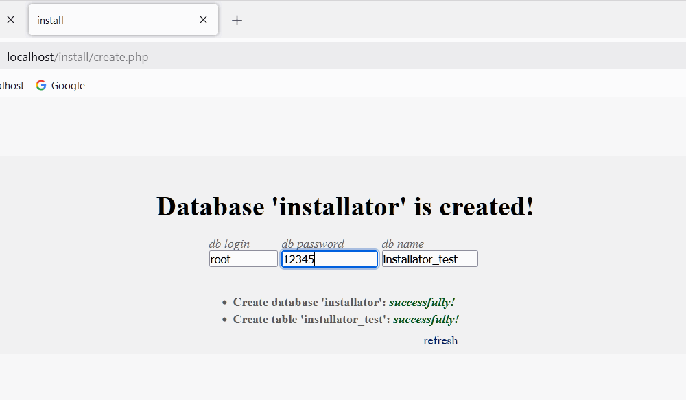
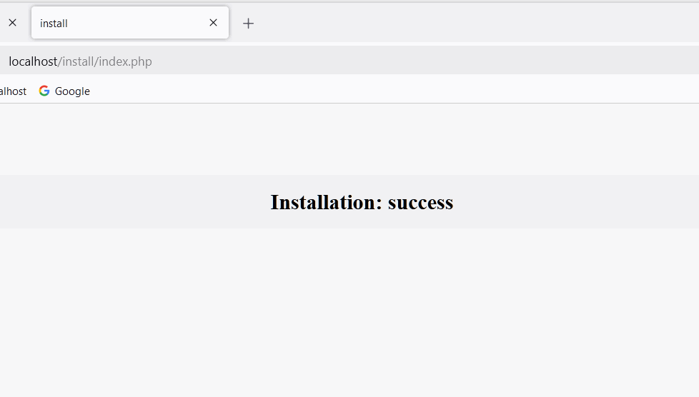

<ol>
<h3>Module 'install' automatically creates a database from the fields: login, passport, database_name</h3>
<li>Required root directory edit file .htaccess:

        <IfModule mod_rewrite.c>
            RewriteEngine on
            RewriteBase /

            RewriteCond %{REQUEST_FILENAME} !-d
            RewriteCond %{REQUEST_FILENAME} !-f
            RewriteCond %{REQUEST_FILENAME} !-l

            #add code..................................................

            # INSTALL APP
            RewriteRule ^install/(.*)$ path_to_app/install/$1 [L]

            #end add code..............................................

        </IfModule>

</li>
<li>Edit MySql settings on are path: install/config/Config.php, install/resources/config.txt</li>

<li>open link browser: <a href="http://localhost/install/">http://localhost/install/</a></li>
</ol>

